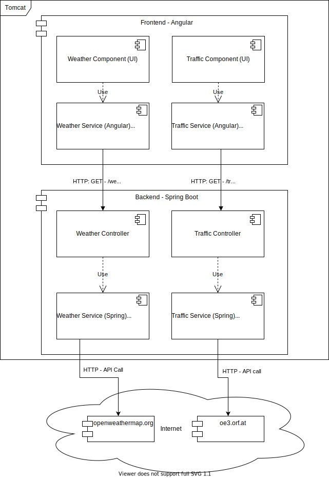
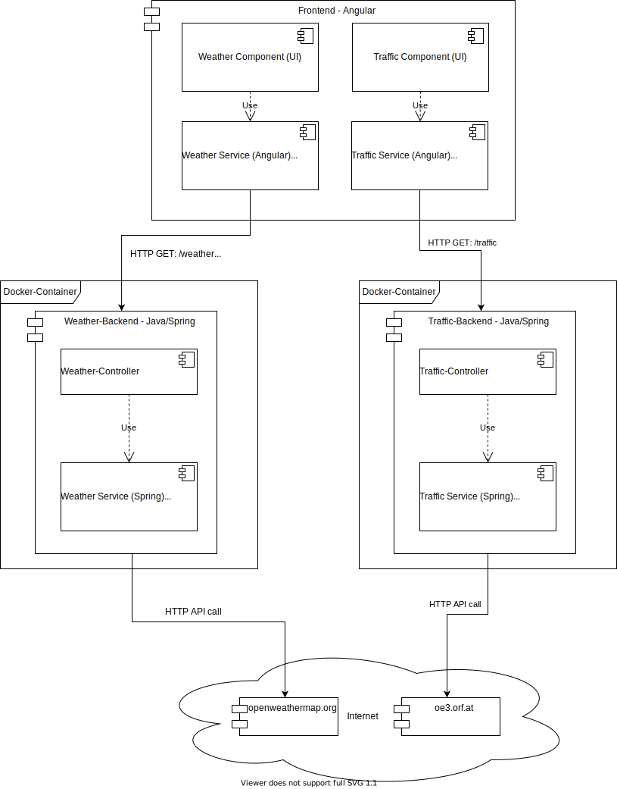

# KV: Special Topics - Cloud Computing from an Engineering Perspective

Repository for the lecture **921CSPTST1K13**

## Team members:

| Name                | Matrikulation Number |
| ------------------- | :------------------- |
| Radic  Nikola       | k01555465            |
| Ratzenböck  Michael | k01606472            |

## Introduction

The entire proposal can be found in [proposal.md](proposal.md). 

The main idea of this project is to split up an already existing monolith into microservices. The monolith consists, provides,roughly speaking three services:

1) A frontend application which is written in Angular.
2) A traffic service, that scrapes traffic data from [ö3](oe3.orf.at) and provides it via an REST API to the frontend
3) A weather service, that gets weather data from [openweathermap](www.openweathermap.org) and also provides it via an REST API to the frontend.

These services should then be split up into _microservices_ and those microservices should be running inside Docker-containers. Moreover, both backend microservices should be managed by Kubernetes.

By splitting the monolith up into microservices it is also easier to set up continuous integration and deployment. For this Github-Actions and Dockerhub should be used.

## The Monolith

The original architecture of the monolith looks something like this:

This depicts the the functionality of the application a bit better. 

Currently, everything gets compiled into a single jar which gets deployed on a local Tomcat Webserver (This is Spring-stuff). The architecture is roughly split into the frontend (Angular) and backend (Java - SpringBoot).

The frontend currently contains two components. First, there is the _Traffic Component_ which is responsible for displaying the traffic information and second, the _Weather Component_ which is responsible for displaying the weather information. Each of the components uses an _Angular Service_ which is used to request the data from the backend. This means, that the frontend makes _localhost_ HTTP calls. 

The backend is a Spring Boot application that currently consists of two _Spring RestControllers_. First, there is the _TrafficController_ which listens for incoming HTTP GET requests on _/traffic_. Second, there is the _WeatherController_ which listens for incoming HTTP GET requests on _/weather_ and _/weatherForecast_. Both of these Controllers use a _Spring Service_ which actually gets the data. This means for example the _TrafficService_ queries data via HTTP from [oe3.orf.at](oe3.orf.at).

## Microservices to the rescue

From the architecture above the monolith ([can be found here](https://github.com/mratzenb/smart-mirror-cloud-computing)) gets split up into three microservices:

1) _frontend-service_ which is essentially the Angular application ([frontend-service](https://github.com/mratzenb/frontend-service)).
2) _traffic-service_ which is responsible for scraping and providing the traffic data from ö3 ([traffic-service](https://github.com/mratzenb/traffic-service)).
3) _weather-service_ which is responsible for providing the weather data from openweathermap ([weather-service](https://github.com/mratzenb/weather-service)).

For this the code base got split up into three separate repositories. The improved architecture looks something like this:


As it can be seen the functionalities are now split up into three independent microservices where each microservice runs in its own Docker-container.

**Note:** both backend services should get managed by Kubernetes.

### Continuous Integration

To support continuous integration Github-Actions are used. Every time a commit is pushed to the _main_ branch the entire project gets build and the tests are run.
Below is the build script that performs a maven build on JDK14 and also includes running the tests.

```yaml
name: Java CI with Maven

on:
  push:
    branches: [ main ]
  pull_request:
    branches: [ main ]

jobs:
  build:
    runs-on: ubuntu-latest

    steps:
    - uses: actions/checkout@v2
    - name: Set up JDK 14
      uses: actions/setup-java@v1
      with:
        java-version: 14
    - name: Build with Maven
      run: mvn -B package --file pom.xml
```

For the frontend-service the script has to be modified. The complete files can be found for the [traffic-service](https://github.com/mratzenb/traffic-service/blob/main/.github/workflows/maven.yml) and for the [weather-service](https://github.com/mratzenb/weather-service/blob/main/.github/workflows/maven.yml). Instead of _Maven_, _npm_ is used for building. The script can be seen below.

```yaml
name: CI
on:
  push:
    branches: [ main ]
  pull_request:
    branches: [ main ]

  workflow_dispatch:

jobs:
  build:
    runs-on: ubuntu-latest
    steps:
      - uses: actions/checkout@v2
      - name: Node $
        uses: actions/setup-node@v2
        with:
          node-version: '10'
          
      - name: npm install and npm run build
        run: |
          npm ci
          npm run build

```

For our build it is important to use a specific node version. The file can be seen [here](https://github.com/mratzenb/frontend-service/blob/main/.github/workflows/main.yml).

### Continuous Deployment / Delivery

## Introducing Kubernetes with Minikube 

Weather-service and traffic-service, should be run in a minikube.
Installation guide for minikube: https://v1-18.docs.kubernetes.io/docs/tasks/tools/install-minikube

First of all we need the .yaml files for both services we want to run there:
[traffic-service](../traffic-service.yml)
[weather-service](../weather-service.yml)

The important part here is:

```yaml
      containers:
            - name: traffic-service
              image: mratzenb/smart-mirror:traffic-service
              ports:
              - containerPort: 8080
            imagePullSecrets:
              - name: regcred
```

Here we need to specify what image to use. We use the one on out docker-hub with the container port 8080. The last part is important so we actually have access to the repository.
We can find the config.json under C:\Users\<User>\.docker and there we need to execute the following command to get our token:

```bash
    kubectl create secret docker-registry regcred --docker-server=https://index.docker.io/v1/ --docker-username=<your-name> --docker-password=<your-pword>
```

Once done you can check the outcome with:

```bash
    kubectl get secret regcred --output=yaml
```

Once the pods are up and running, the last thing to do is to run the frontend-service:

```bash
    docker run -p 4200:80 mratzenb/smart-mirror:frontend-service
```

And to configure the port forwarding for the weather- and traffic-service:

```bash
    kubectl port-forward service/weather-service 8081:8080
    kubectl port-forward service/traffic-service 8080:8080
```
