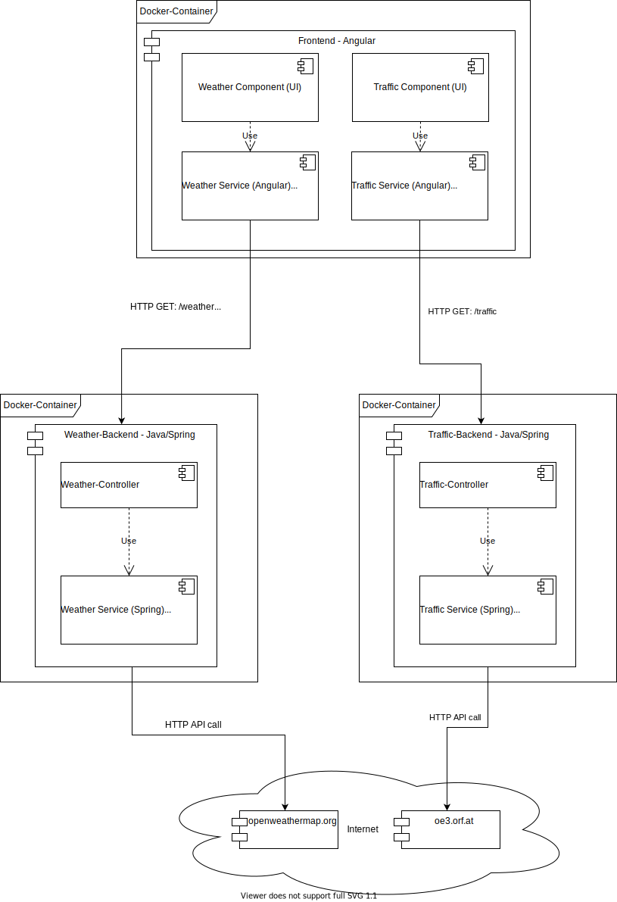

# KV: Special Topics - Cloud Computing from an Engineering Perspective

Repository for the lecture **921CSPTST1K13**

## Team members:

| Name                | Matrikulation Number |
| ------------------- | :------------------- |
| Radic  Nikola       | k01555465            |
| Ratzenböck  Michael | k01606472            |

## Introduction

The entire proposal can be found in [proposal.md](proposal.md). 

The main idea of this project is to split up an already existing monolith into microservices. The monolith consists, provides,roughly speaking three services:

1) A frontend application which is written in Angular.
2) A traffic service, that scrapes traffic data from [ö3](oe3.orf.at) and provides it via an REST API to the frontend
3) A weather service, that gets weather data from [openweathermap](www.openweathermap.org) and also provides it via an REST API to the frontend.

These services should then be split up into _microservices_ and those microservices should be running inside Docker-containers. Moreover, both backend microservices should be managed by Kubernetes.

By splitting the monolith up into microservices it is also easier to set up continuous integration and deployment. For this Github-Actions and Dockerhub should be used.

## The Monolith

The original architecture of the monolith looks something like this:

This depicts the the functionality of the application a bit better. 

Currently, everything gets compiled into a single jar which gets deployed on a local Tomcat Webserver (This is Spring-stuff). The architecture is roughly split into the frontend (Angular) and backend (Java - SpringBoot).

The frontend currently contains two components. First, there is the _Traffic Component_ which is responsible for displaying the traffic information and second, the _Weather Component_ which is responsible for displaying the weather information. Each of the components uses an _Angular Service_ which is used to request the data from the backend. This means, that the frontend makes _localhost_ HTTP calls. 

The backend is a Spring Boot application that currently consists of two _Spring RestControllers_. First, there is the _TrafficController_ which listens for incoming HTTP GET requests on _/traffic_. Second, there is the _WeatherController_ which listens for incoming HTTP GET requests on _/weather_ and _/weatherForecast_. Both of these Controllers use a _Spring Service_ which actually gets the data. This means for example the _TrafficService_ queries data via HTTP from [oe3.orf.at](oe3.orf.at).

In this approach the frontend part does not require anything special in order to run, since it gets built via npm build and afterwards deployed to the tomcat that is managed by Spring.

## Microservices to the rescue

From the architecture above the monolith ([can be found here](https://github.com/mratzenb/smart-mirror-cloud-computing)) gets split up into three microservices:

1) _frontend-service_ which is essentially the Angular application ([frontend-service](https://github.com/mratzenb/frontend-service)).
2) _traffic-service_ which is responsible for scraping and providing the traffic data from ö3 ([traffic-service](https://github.com/mratzenb/traffic-service)).
3) _weather-service_ which is responsible for providing the weather data from openweathermap ([weather-service](https://github.com/mratzenb/weather-service)).

For this the code base got split up into three separate repositories. The improved architecture looks something like this:


As it can be seen the functionalities are now split up into three independent microservices where each microservice runs in its own Docker-container.

**Note:** both backend services should get managed by Kubernetes.

### Docker Containers

For the two backend services nothing really changes in terms of running them inside a docker container. The following snippet shows the Dockerfile for the weather-service which is basically identical to the traffic-service one except that the names differ.

```docker
FROM maven:3.6-adoptopenjdk-14 AS build

COPY ./src/ /home/weather-service/src
COPY ./pom.xml /home/weather-service/pom.xml

RUN ls -a /home/weather-service
RUN mvn -f /home/weather-service/pom.xml clean package

#
# Package stage
#
FROM adoptopenjdk:14-jdk-hotspot
COPY --from=build /home/weather-service/target/*.jar /usr/local/lib/weather-service.jar
EXPOSE 8080
# Run with "--enable-preview" because the application uses preview features.
ENTRYPOINT ["java", "--enable-preview","-jar","/usr/local/lib/weather-service.jar"]
```

For building maven is used as in the monolith.

The frontend service needs more work because the angular application now has to run on a different web-server. For this _nginx_ is used but this also requires an additional config file which can be seen in the following code snippet.

```json
events{}
http {
    include /etc/nginx/mime.types;
    server {
        listen 80 ssl;
        server_name localhost;
        root /usr/share/nginx/html;
        index index.html;

        location / {
            try_files $uri $uri/ /index.html;
        }
    }
}
```

This essentially tells nginx to listen to port 80 and provide the generated index.html file. With this the Dockerfile for the frontend-service looks as follows:

```Docker
#### Build the app
FROM node:10.23.0-alpine3.10 AS build
WORKDIR /usr/src/app
COPY package.json package-lock.json ./
RUN npm install -g @angular/cli
RUN npm install
COPY . .
RUN ng build --prod

#### Run the app
FROM nginx:1.19.6
COPY nginx.conf /etc/nginx/nginx.con
COPY --from=build /usr/src/app/dist/frontend-service /usr/share/nginx/html
```

### Continuous Integration

To support continuous integration Github-Actions are used. Every time a commit is pushed to the _main_ branch the entire project gets build and the tests are run.
Below is the build script that performs a maven build on JDK14 and also includes running the tests.

```yaml
name: Java CI with Maven and CD to Dockerhub

on:
  push:
    branches: [ main ]

jobs:
  build:
    runs-on: ubuntu-latest
    steps:
    - uses: actions/checkout@v2
    - name: Set up JDK 14
      uses: actions/setup-java@v1
      with:
        java-version: 14
    - name: Build with Maven
      run: mvn -B package --file pom.xml
```

For the frontend-service the script has to be modified. The complete files can be found for the [traffic-service](https://github.com/mratzenb/traffic-service/blob/main/.github/workflows/main-branch.yml) and for the [weather-service](https://github.com/mratzenb/weather-service/blob/main/.github/workflows/main-branch.yml). Instead of _Maven_, _npm_ is used for building. The script can be seen below.

```yaml
name: NPM CI with CD to Dockerhub
on:
  push:
    branches: [ main ]
  # Allows you to run this workflow manually from the Actions tab
  workflow_dispatch:
jobs:
  build:
    runs-on: ubuntu-latest
    steps:
      - uses: actions/checkout@v2
      - name: Node $
        uses: actions/setup-node@v2
        with:
          node-version: '10'
      - name: npm install and npm run build
        run: |
          npm ci
          npm run build
```

For our build it is important to use a specific node version. The file can be seen [here](https://github.com/mratzenb/frontend-service/blob/main/.github/workflows/main-branch.yml).

Furthermore, the build step gets executed on each push to the repository. This means that every time a push happens to any branch (except for main) the branch gets built. The files can be found here:
* [frontend-service-branch](https://github.com/mratzenb/frontend-service/blob/main/.github/workflows/branch.yml)
* [traffic-service-branch](https://github.com/mratzenb/traffic-service/blob/main/.github/workflows/branch.yml)
* [weather-service-branch](https://github.com/mratzenb/weather-service/blob/main/.github/workflows/branch.yml)

The important part is the following:

```yaml
on:
  push:
    branches-ignore:
      - 'main'
      - main
```

This ensures that this action is only executed on a push to a branch that is not equal to main.

#### Branch protection

Since we do not want that anyone is able to merge on the main branch without having the code approved the main branch has to be protected. This is done by only allowing pull-requests. Furthermore, a merge of a pull-request should only be possible if the feature-build step was successful. The settings can be found here:


### Continuous Delivery

The important part of the yaml file is:

```yaml
  publish:
      needs: build
      runs-on: ubuntu-latest
      steps:
        -
          name: Set up QEMU
          uses: docker/setup-qemu-action@v1
        -
          name: Set up Docker Buildx
          uses: docker/setup-buildx-action@v1
        -
          name: Login to DockerHub
          uses: docker/login-action@v1 
          with:
            username: ${{ secrets.DOCKERHUB_USERNAME }}
            password: ${{ secrets.DOCKERHUB_TOKEN }}
        -
          name: Build and push
          id: docker_build
          uses: docker/build-push-action@v2
          with:
            push: true
            tags: mratzenb/smart-mirror:frontend-service
```

The important step here is, that in order to access Dockerhub, user credentials are needed. For this an access token for dockerhub was created and added as credentials to the repositories.

### Github Workflow

The entire Github-Workflow looks something like this


As it can be seen each created repository now has two Github-Actions which do basically all the same.

First, the entire project gets built. Hence, this is named the **build** Action. This means the two backend services (traffic and weather) perform a _maven package_ which also runs the tests. The frontend service performs a _npm build_ which performs a full build on the Angular project. Currently, there are no tests for the frontend which could be run...

Second, after a successful build, a docker image, which contains the runnable version of each micro-service, gets created and is then published to Dockerhub. This action is called **publish**.

When pushing to a branch different to _main_ only the build action is triggered. This also means that when submitting a pull request the build appears as check which means there cannot be a merge if the build or tests fail.

### Dockerhub Workaround

Since the weather-service contains a sensitive API-key we do not want to publish the Docker-images to a public Dockerhub repository. Since Dockerhub only allows one private repository for the free account we abuse the tagging system.

Instead of _traffic-service:major.minor_ we use the version to indicate the actual service. All services have the same name (_smart-mirror_) but their version number indicates the actual service. The images on Dockerhub are:

* mratzenb/smart-mirror:frontend-service
* mratzenb/smart-mirror:traffic-service
* mratzenb/smart-mirror:weather-service

We know, that this is not the intended way but we want to keep the API keys private.

## Introducing Kubernetes with Minikube

Weather-service and traffic-service, should be run in a minikube.
Installation guide for minikube: https://v1-18.docs.kubernetes.io/docs/tasks/tools/install-minikube

First of all we need the .yaml files for both services we want to run there:
[traffic-service.yml](./K8/traffic-service.yml)
[weather-service.yml](./K8/weather-service.yml)

The important part here is:

```yaml
      containers:
            - name: traffic-service
              image: mratzenb/smart-mirror:traffic-service
              ports:
              - containerPort: 8080
            imagePullSecrets:
              - name: regcred
```

Here we need to specify what image to use. We use the one on out docker-hub with the container port 8080. The last part is important so we actually have access to the repository.
We can find the config.json under C:\Users\<User>\.docker and there we need to execute the following command to get our token:

```bash
    kubectl create secret docker-registry regcred --docker-server=https://index.docker.io/v1/ --docker-username=<your-name> --docker-password=<your-pword>
```

Once done you can check the outcome with:

```bash
    kubectl get secret regcred --output=yaml
```

Once the pods are up and running, the last thing to do is to run the frontend-service (because it will not be managed by Kubernetes):

```bash
    docker run -p 4200:80 mratzenb/smart-mirror:frontend-service
```

And to configure the port forwarding for the weather- and traffic-service:
(This is needed because we run our Kurbernetes clusters locally on Minikube.)

```bash
    kubectl port-forward service/weather-service 8081:8080
    kubectl port-forward service/traffic-service 8080:8080
```

### Scaling

If we have to scale the backend-services we would increase the replica and we would also use a load-balancer.