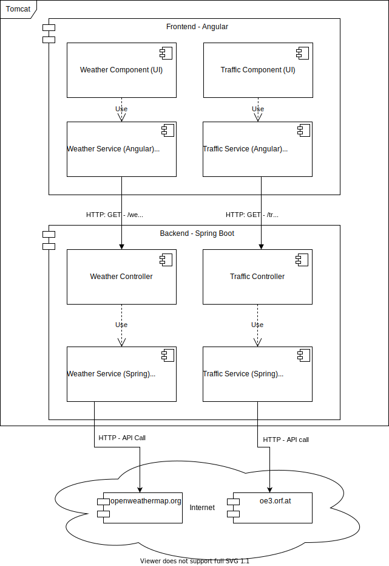

# Monolith-Archticture
Here is a more detailed description of the monolith. The architecture can be seen in the following picture.

Currently, everything gets compiled into a single jar which gets deployed on a local Tomcat Webserver (This is Spring-stuff). The architecture is roughly split into the frontend (Angular) and backend (Java - SpringBoot). 

The frontend currently contains two components. First, there is the _Traffic Component_ which is responsible for displaying the traffic information and second, the _Weather Component_ which is responsible for displaying the weather information. Each of the components uses an _Angular Service_ which is used to request the data from the backend. This means, that the frontend makes _localhost_ HTTP calls. 

The backend is a Spring Boot application that currently consists of two _Spring RestControllers_. First, there is the _TrafficController_ which listens for incoming HTTP GET requests on _/traffic_. Second, there is the _WeatherController_ which listens for incoming HTTP GET requests on _/weather_ and _/weatherForecast_. Both of these Controllers use a _Spring Service_ which actually gets the data. This means for example the _TrafficService_ queries data via HTTP from oo3.orf.at. 